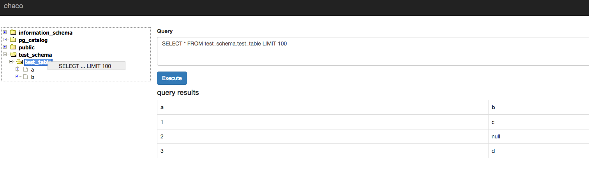

Chaco
======
Chaco is a WEB UI for DB operation like MySQL Workbench.

Chaco comes from `The Story on a Seashore for Chaco` that is the music name of Japanese famous rock band `Southern All Stars`

# Requirements

* Java 8

# Quick Start

Edit configuration file
----------------

    vim src/main/resources/config/local.yaml

Start the server
----------------

    mvn jetty:run -Dchaco.env=local

see http://localhost:8080/ 
